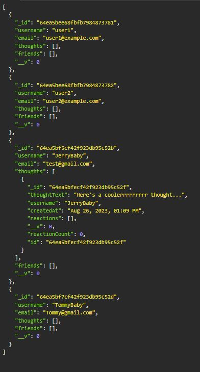
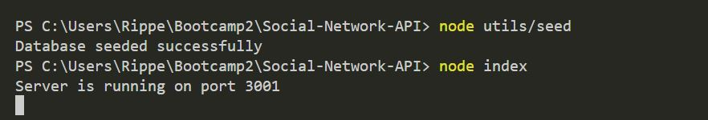

# Social-Network-API
This is the back-end to a potential Social Network app/website.

## General Information
With This Custom API we can create users, thoughts and reactions to their thoughts or even add people as friends. 

## Features

- Ability to create new Users, Thoughts and reactions
- You can update a users email or username
- Create Delete a User, Thought, Friend or Reaction
- Add friends
- Update a thought
- Find Users or thoughts by ID

## Screenshots / Links

Link to a walkthrough video!
[NetworkAPI.webm](https://github.com/TristanM225/Social-Network-API/assets/126945628/a13d0fdf-91c7-4f13-8e38-bd35249650f8)

 
## Setup
- Set up requires you to npm i
- then node utils/seed to get the pre seeded data
- then node index to start the program
- open insomniac and you’re ready to go!

## Usage
- It will be the back-end of a social networking application. You can post your thoughts and react to others' thoughts. 

## Project Status
Project is: _complete_

## Room for Improvement

Room for improvement:
- Cleaning up code
- Manage the code better by splitting it up

To do:
- Create the option to upload a photo or video
- Create the front end of the application to complete it

## Credit / Acknowledgements
- Huge Credit to Micheal and Nhadea Lensky
- Find Nhadea on Github itsa-me-dea and a link to her repo that helped me complete this project. https://github.com/itsa-me-dea
- Also w3schools.com for documentation on nosql https://www.w3schools.com/nodejs/nodejs_mongodb.asp 
- Biggest thanks to Micheal for encouraging me to not give up!

## Contact
Created by TristanM225 Reach out to me by email! TristanM225@gmail.com

